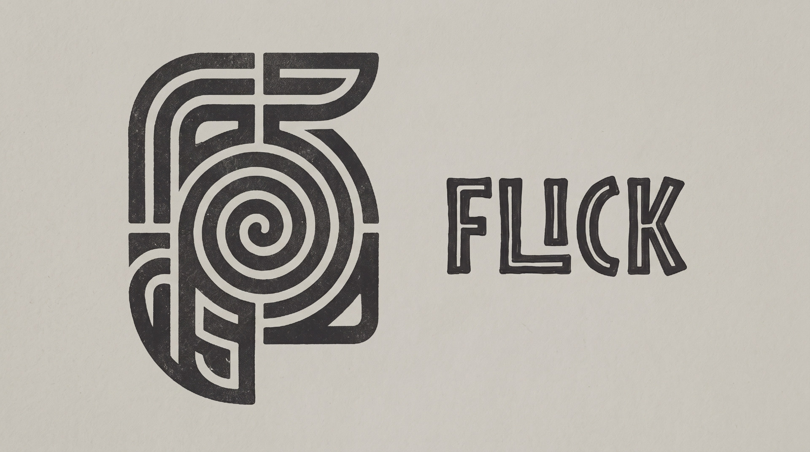

# Flick

A small native launcher for macOS. **Option+Space** opens a dark HUD. Type, pick, return.

Flick does not talk to Spotlight. It keeps a fast in-memory catalog of apps, Desktop / Documents / Downloads, clipboard history, and a short command list.

## Download

**[Flick 1.0.1 for Mac (Apple Silicon)](https://github.com/Abhijit-without-h/Flick/releases/latest/download/Flick-1.0.1.dmg)**

Also: [zip](https://github.com/Abhijit-without-h/Flick/releases/latest/download/Flick-1.0.1.zip) · [all releases](https://github.com/Abhijit-without-h/Flick/releases)

1. Open the DMG and drag **Flick** onto **Applications**.
2. First launch: right-click Flick → **Open** (it is ad-hoc signed, not notarized).
3. Look for the Flick mark in the menu bar. **Option+Space** opens search.

macOS 14+, Apple Silicon (M1 and later). No Dock icon.

## Close

Esc, Option+Space, ⌘W, click outside, or the × in the field.

## Build from source

```bash
make install
```

Requires the Swift toolchain (Command Line Tools is enough). `make dist` writes `dist/Flick-<version>.dmg` and `.zip`.

## Build

```bash
make app      # dist/Flick.app
make run      # build and open
make test     # core tests
```

## Search

| You type | Flick does |
| --- | --- |
| `saf` | Launch Safari |
| `12*8` | Copy `96` |
| `~/Projects` | Open that folder |
| `example.com` | Open the URL |
| `quit` | Quit a running app |
| `sleep` | Sleep the Mac |

Also: Empty Trash, Lock Screen, Dark Mode, Kill, clipboard history (last 20 strings; password-manager secrets are skipped).

↓↑ to move, ↩ to run, ⌘↩ to reveal in Finder, ⌘K for actions on the selected row.

Rebind the hotkey from the menu bar extra if Option+Space is taken.

Internals: [docs/design.md](docs/design.md).
